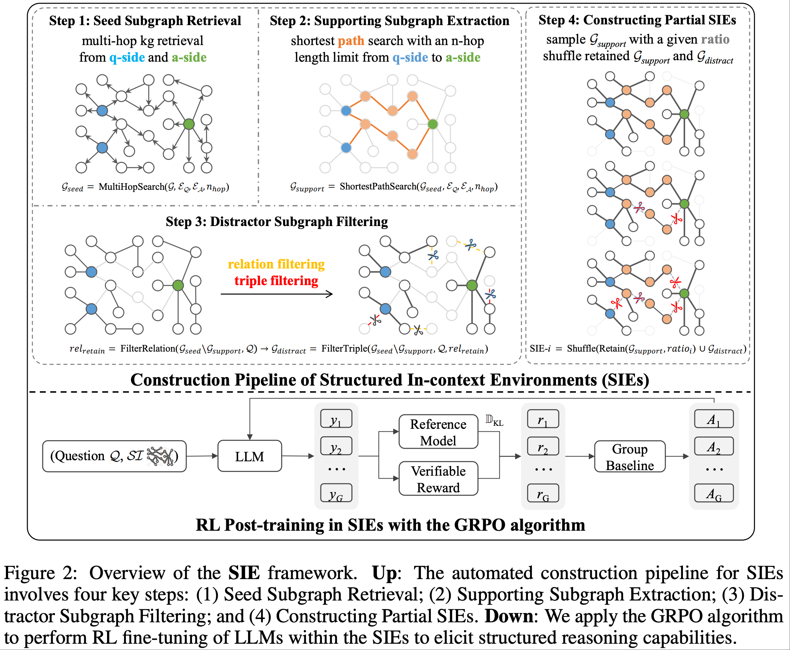

# SIE

This is an open-source framework for *Learning to Reason in **S**tructured **I**n-context **E**nvironments with Reinforcement Learning*.


## Introduction
Large language models (LLMs) have achieved significant advancements in reasoning capabilities through reinforcement learning (RL) via environmental exploration. As the intrinsic properties of the environment determine the abilities that LLMs can learn, the environment plays a important role in the RL finetuning process. An ideal LLM reasoning environment should possess three core characteristics: scalability, generalizable reasoning, and verifiability. However, existing mathematical and coding environments are difficult to scale due to heavy reliance on expert annotation, while the skills learned in game-based environments are too specialized to generalize. To bridge this gap, we introduce the \textbf{S}tructured \textbf{I}n-context \textbf{E}nvironment (SIE) framework. SIE achieves scalability by automatically constructing reasoning environments from large-scale structured data, where the rich compositional patterns naturally support generalizable reasoning. Moreover, the explicit schemas and reasoning chains in structured data provide a foundation for rule-based verifiability. Experimental results show that SIE framework not only achieves substantial improvements in in-domain structured reasoning, but also enables the learned compositional reasoning skills to generalize effectively to out-of-domain mathematical and logical reasoning tasks. We further explored learning in information-limited partial SIEs and found that LLMs can infer the missing information through exploring the environment, leading to robust reasoning improvements and generalization performance.

## Overview


## Installation
Follow https://github.com/volcengine/verl and prepare environment for verl.

## Training
Run bash examples/sie_trainer/run_it_grpo_0.sh

## Evaluation 
Set trainer.val_before_train=True and trainer.val_only=True.

## Citation
If you find this work useful, please consider citing:
```
@misc{yu2025learningreasonstructuredincontext,
      title={Learning to Reason in Structured In-context Environments with Reinforcement Learning}, 
      author={Peng Yu and Zeyuan Zhao and Shao Zhang and Luoyi Fu and Xinbing Wang and Ying Wen},
      year={2025},
      eprint={2509.23330},
      archivePrefix={arXiv},
      primaryClass={cs.CL},
      url={https://arxiv.org/abs/2509.23330}, 
}
```